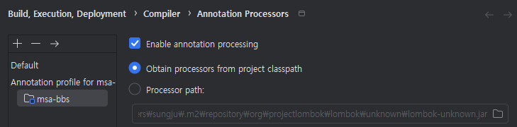

# msa-bbs
## 12.25 정리
* 게시판 목록조회까지
* spring-security 설정하면 처음 id, passwd는 user/console에 뜨는거 입력하기.
* DB->Mapper->Service->Controller->html
  * 백 -> 프론트 순으로 만듬
  * 기존 msa-member 참고함
  * 근데 왜 template parsing (template: "class path resource [templates/manager/bbs_master_list.html]") 에러가 뜨는지 모르겠음.
    * => @Data 가 Getter, Setter를 못 불러와서 그런듯. member에서도 이랬었는데 왜 이러지?
    * => 강제로 Getter, Setter 주입하니까 화면에 데이터 뿌리기까지 성공
      * 해결방법 ====>>  두 개 체크해줘야 함.

## 12.26 정리
* 게시판 등록, 수정까지
* controller 하나로 다 이동가능. checkModel()로 분기
```java
@RequestMapping(value = "/{dirPath}/{pageName}.page")
    public String dynamicPage(@PathVariable("dirPath") String dirPath, @PathVariable("pageName") String pageName, Model model) {
        checkModel(pageName, "", model);
        return "/" + dirPath + "/" + pageName;
    }
```
* html 파일 하나로 등록과 수정을 같이 이용.
```html
<button type="button" th:if="${bbsId == '' || bbsId == null}"     class="btn btn-primary" onclick="save('CREATE')"><span th:text="${btnName}">등록</span></button>
<button type="button" th:unless="${bbsId == '' || bbsId == null}" class="btn btn-primary" onclick="save('UPDATE')"><span th:text="${btnName}">수정</span></button>
```
```shell
var url = '';
if (mode === 'CREATE') {
    url = '/manager/create_bbs_master.do';
} else {
    url = '/manager/update_bbs_master.do';
}
```

## 12.29 정리
* 삭제 기능
  ```shell
  <a class="btn btn-sm btn-danger" th:attr="data-bbs-id=${bbs.bbsId}" onclick="deleteBbsMaster(this)">삭제</a>
  ```
  * thymleaf에서는 문자열 데이터를 이벤트 핸들러 속성에 직접 사용하려고 하면 보안상의 이유로 제한 발생. 숫자나 boolean 값만 신뢰함.
    * 해결방법 => data-* 속성을 사용.

### 재가동하지 않고 변경사항 반영하기
  1. application.properties설정
  ```properties
  spring.thymeleaf.cache=false
  spring.thymeleaf.prefix=classpath:/templates/
  spring.thymeleaf.suffix=.html
  ```
  2. spring boot devtools 사용
  ```xml
  <dependency>
      <groupId>org.springframework.boot</groupId>
      <artifactId>spring-boot-devtools</artifactId>
      <scope>runtime</scope>
  </dependency>
  ```
  3. File > Settings > Advanced Settings > Allow auto-make to start even if developed application is currently running 활성화
  
* 게시글 기능 DB 설계 및 생성완료 PPT참고

## 12.30 정리
* 게시글 조회
* bbs_ main / master 분리
* 게시글 조회 할 때 sql에서 join해서 가져오면 중복됌.(ex) 첨부파일이 두 개, 댓글이 두 개면 총 네 개가 조회되어버림.)
* 각자 조회해오는 service를 만들고, controller단에서 조합해서 화면으로 던져주기
* 잘 안 될때는 일단 코딩해보고 중복되는 부분을 변수화하고, 하나로 합치기. 하드코딩X!

## 01.04 정리
* 게시글 댓글 기능
* 리다이렉션 안 하고 리스트 밑에 append()
* 시간 관련
  1. sql에서 now()로 시간 넣기
    * now()로 넣고, 댓글 조회해와서 result.put() 하기  ==> 이게 제일 좋은 방법 나중에 보안도 생각하면..
  2. java에서 시간 넣기
  3. javascript에서 시간 넣기

## 01.06 wjdfl
* 게시글 답글 기능
* recursive() 상-하위 관계별로 조회해오는 sql문 이용.
  ```shell
  WITH RECURSIVE find_cmt(bbs_id, bbs_no, bbs_cmt_seq, bbs_cmt_writer, bbs_cmt_wtime, bbs_comment, bbs_cmt_upseq)
        AS (
        -- START_QUERY: 최상위 댓글 찾기
        SELECT bbs_id, bbs_no, bbs_cmt_seq, bbs_cmt_writer, bbs_cmt_wtime, bbs_comment, bbs_cmt_upseq
        FROM bbs_comment
        WHERE 1=1
        AND bbs_id = #{bbsId}
        AND bbs_no = #{bbsNo}
        AND bbs_cmt_upseq = 0

        UNION ALL

        -- REPEAT_QUERY: 답글 찾기
        SELECT bc.bbs_id, bc.bbs_no, bc.bbs_cmt_seq, bc.bbs_cmt_writer, bc.bbs_cmt_wtime, bc.bbs_comment, bc.bbs_cmt_upseq
        FROM find_cmt fc
        INNER JOIN bbs_comment bc
        ON fc.bbs_cmt_seq = bc.bbs_cmt_upseq -- 부모 댓글-답글 관계
        AND bc.bbs_id = #{bbsId}                -- 동일 게시글
        AND bc.bbs_no = #{bbsNo}                   -- 동일 게시글 번호
        )
        -- VIEW_QUERY
        SELECT *
        FROM find_cmt
        ORDER BY
        CASE
        WHEN bbs_cmt_upseq = 0 THEN bbs_cmt_seq -- 댓글은 그대로 시간순으로 정렬
        ELSE bbs_cmt_upseq                     -- 답글은 부모 댓글 바로 아래로 정렬
        END,
        bbs_cmt_seq
  ```

## 01.09 정리
* 게시판 성격별 미완성 기능 추가
* bbsUserWriteYn 컬럼 추가
* newHour 관련
  * sql에서 처리 24h, 48h 등 시간단위 표시라서 이렇게 처리함.
  ```shell
    (EXTRACT(EPOCH FROM NOW() - bbs_wtime) / 3600) AS new_time
  ```
  
## 01.10 정리
* 게시글 등록 기능 추가

## 01.11 정리
* jpa
  1. dependency 추가
  2. application.properties 추가
* vo랑 model이랑 비슷한데 다름.
* jpa에서 model을 정의할 때는 실제 테이블인지 명시해주는 게 있음.
* dialect는 방언이라는 뜻. db가 다양하니까 내가 선택한 db로 하면 됌.

* @entity 는 객체라는 뜻.
* @Table은 DB 테이블 이름이랑 다를 때 지정.

* @GeneratedValue(strategy = GenerationType.IDENTITY) 자동증가
* @Column(nullable = false, unique = true)    //not null, unique
* 생성자를 꼭 만들어줘야 함.

* Repository
* jpaRepository에서 기능들을 함수로 구현해놔있음. extends 해서 쓰면 됌.
* postgre문법에 맞는 문장을 자동으로 만들어줌

```java
Role findByRoleName (String roleName); ==> where name = ${name}
Role findByRoleNameContains (String roleName); ==> where name LIKE ${NAME} || '%'
Role findByRoleNameContainsIgnoreCase (String roleName);  ==> where upper(name) LIKE upper (${NAME}) || '%'
```

```shell
controller -> service -> mapper -> sql                    --> 기존
                      -> reposotory -> model -> Dialect   --> jpa
```

* 테이블 생성하지 않아도 실행하면 테이블 만들어져 있음..